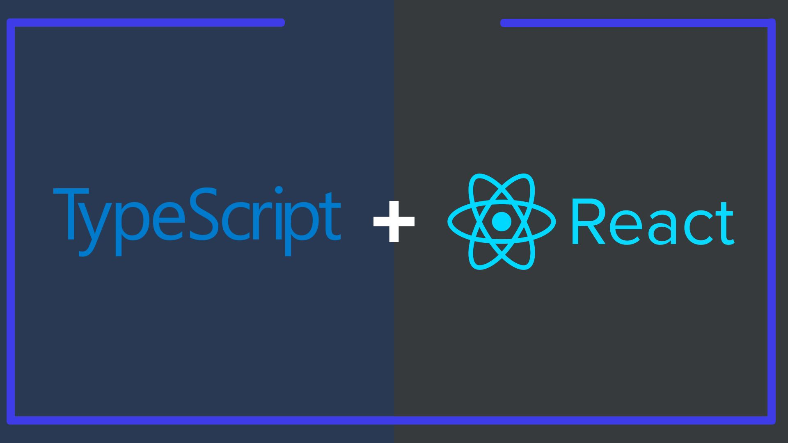

# TypeScript Projects

 

This repository gathers projects built with React and TypeScript. The projects have the purpose of study, being built to practice the technologies. The projects are listed below.

## Projects 🌐

| **Name** | **GitHub** | **Preview Site** | **Desktop** | **Mobile** |
|--|--|--|--|--|
|TODOApp - Front-end|[Link](https://github.com/diogosaucedo/todo-app-frontend)| Unavailable| ✅ | ❌ |
|TODOApp - API|[Link](https://github.com/diogosaucedo/todo-app-backend)| Unavailable| ❌ | ❌ |
|Markdown Editor|[Link](https://github.com/diogosaucedo/markdown-editor)| [Link](https://diogosaucedo.github.io/markdown-editor/)| ✅ | ❌ |
|Binary Search|[Link](https://github.com/diogosaucedo/binary-search)| [Link](https://diogosaucedo.github.io/binary-search/)| ✅ | ✅ |
|Lap Counter|[Link](https://github.com/diogosaucedo/lap-counter)| [Link](https://diogosaucedo.github.io/lap-counter/)| ✅ | ❌ |
|Quiz|[Link](https://github.com/diogosaucedo/Quiz)| [Link](https://diogosaucedo.github.io/Quiz/)| ✅ | ❌ |
|Paging Component|[Link](https://github.com/diogosaucedo/Paging-Component)| [Link](https://diogosaucedo.github.io/Paging-Component/)| ✅ | ✅ |
|Learning TDD|[Link](https://github.com/diogosaucedo/TDD)| Unavailable | ❌ | ❌ |

## Technologies

  
  
  
  
  
  
  

## Run projects 👨🏾‍💻

The listed projects may contain different structures and dependencies, so each project has a `README.md` file that describes which commands are available for execution.

## Notes ⚠️

Some projects will still undergo code improvements.
